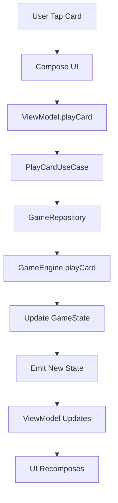

# SpireSmiths Technical Architecture

## 🏗️ Architecture Overview

SpireSmiths follows a **Clean Architecture** pattern combined with **MVVM (Model-View-ViewModel)** for the presentation layer. This ensures separation of concerns, testability, and maintainability while providing a scalable foundation for future multiplayer features.

```
┌─────────────────────┐    ┌─────────────────────┐    ┌─────────────────────┐
│   Presentation      │    │      Domain         │    │       Data          │
│     Layer           │    │      Layer          │    │      Layer          │
│                     │    │                     │    │                     │
│ • UI (Compose)      │◄───┤ • Use Cases         │◄───┤ • Repositories      │
│ • ViewModels        │    │ • Entities          │    │ • Data Sources      │
│ • Navigation        │    │ • Repository        │    │ • Database (Room)   │
│ • DI (Hilt)         │    │   Interfaces        │    │ • Network (Future)  │
└─────────────────────┘    └─────────────────────┘    └─────────────────────┘
```

---

## 📱 Technology Stack

### Core Technologies
- **Language**: Kotlin 1.9.0+
- **Minimum SDK**: API 24 (Android 7.0)
- **Target SDK**: API 34 (Android 14)
- **Build System**: Gradle with Version Catalogs

### UI Framework
- **Jetpack Compose**: Modern declarative UI toolkit
- **Material Design 3**: Latest design system
- **Custom Components**: Game-specific UI elements
- **Accompanist**: Additional Compose utilities

### Architecture Components
- **ViewModel**: Presentation layer state management
- **LiveData/StateFlow**: Reactive data streams
- **Navigation Compose**: Type-safe navigation
- **Room**: Local database management
- **Hilt**: Dependency injection framework

### Testing Framework
- **JUnit 5**: Unit testing framework
- **Mockk**: Mocking library for Kotlin
- **Espresso**: UI testing framework
- **Compose Testing**: Compose-specific testing utilities
- **Truth**: Fluent assertion library

---

## 🏛️ Architectural Layers

### 1. Presentation Layer
**Responsibility**: User interface and user interaction handling

#### Components:
- **UI Components** (Jetpack Compose)
  - Screens and composables
  - Custom game UI components
  - Animation and transitions
  - Theme and styling

- **ViewModels**
  - Screen state management
  - User action handling
  - Business logic orchestration
  - Navigation triggers

- **Navigation**
  - Screen routing
  - Deep link handling
  - Navigation state management

#### Key Files:
```
presentation/
├── ui/
│   ├── screens/
│   │   ├── game/
│   │   ├── menu/
│   │   └── deck/
│   ├── components/
│   │   ├── cards/
│   │   ├── board/
│   │   └── common/
│   └── theme/
├── viewmodels/
└── navigation/
```

### 2. Domain Layer
**Responsibility**: Business logic and game rules

#### Components:
- **Entities**: Core business objects
  - Card, Player, Game, Deck
  - Immutable data classes
  - Business logic methods

- **Use Cases**: Specific business operations
  - PlayCardUseCase
  - AttackWithCreatureUseCase
  - EndTurnUseCase
  - BuildDeckUseCase

- **Repository Interfaces**: Data access contracts
  - CardRepository
  - GameRepository
  - PlayerRepository

- **Game Engine**: Core game logic
  - Turn management
  - Card effect resolution
  - Win condition checking
  - Rule validation

#### Key Files:
```
domain/
├── entities/
├── usecases/
├── repositories/
└── engine/
    ├── GameEngine.kt
    ├── TurnManager.kt
    ├── EffectResolver.kt
    └── RuleValidator.kt
```

### 3. Data Layer
**Responsibility**: Data persistence and external data sources

#### Components:
- **Repository Implementations**: Data access implementation
  - Local data source coordination
  - Future network data source coordination
  - Data transformation and mapping

- **Local Data Sources**: Room database
  - Entity definitions
  - Data Access Objects (DAOs)
  - Database migrations
  - Type converters

- **Remote Data Sources** (Future): Network API
  - Retrofit services
  - Response models
  - Network error handling

#### Key Files:
```
data/
├── local/
│   ├── database/
│   ├── entities/
│   └── dao/
├── remote/ (future)
├── repositories/
└── mappers/
```

---

## 🎮 Game Engine Architecture

### Core Game Engine
The game engine is the heart of SpireSmiths, managing all game state and rule enforcement.

```kotlin
interface GameEngine {
    suspend fun startGame(player1: Player, player2: Player): Game
    suspend fun playCard(gameId: String, playerId: String, cardId: String, target: Target?): GameResult
    suspend fun attackWithCreature(gameId: String, attackerId: String, defenderId: String?): GameResult
    suspend fun endTurn(gameId: String, playerId: String): GameResult
    suspend fun getGameState(gameId: String): GameState
}
```

### State Management
```kotlin
data class GameState(
    val id: String,
    val players: List<PlayerState>,
    val currentPlayerIndex: Int,
    val turn: Int,
    val phase: GamePhase,
    val board: BoardState,
    val history: List<GameEvent>
)

data class PlayerState(
    val id: String,
    val health: Int,
    val mana: Int,
    val maxMana: Int,
    val hand: List<Card>,
    val deck: Deck,
    val board: List<Creature>
)
```

### Event System
```kotlin
sealed class GameEvent {
    data class CardPlayed(val playerId: String, val card: Card, val target: Target?) : GameEvent()
    data class CreatureAttacked(val attackerId: String, val defenderId: String?, val damage: Int) : GameEvent()
    data class TurnEnded(val playerId: String) : GameEvent()
    data class GameEnded(val winnerId: String, val reason: WinCondition) : GameEvent()
}
```

---

## 🤖 AI System Architecture

### AI Framework
```kotlin
interface AIPlayer {
    suspend fun makeMove(gameState: GameState): AIAction
    fun getDifficulty(): AIDifficulty
    fun getPersonality(): AIPersonality
}

sealed class AIAction {
    data class PlayCard(val cardId: String, val target: Target?) : AIAction()
    data class Attack(val attackerId: String, val defenderId: String?) : AIAction()
    object EndTurn : AIAction()
}
```

### Decision Making System
```kotlin
interface AIDecisionEngine {
    fun evaluateGameState(gameState: GameState): Float
    fun generatePossibleMoves(gameState: GameState): List<ScoredMove>
    fun selectBestMove(moves: List<ScoredMove>): AIAction
}

data class ScoredMove(
    val action: AIAction,
    val score: Float,
    val reasoning: String
)
```

---

## 💾 Database Schema

### Room Database Structure
```kotlin
@Database(
    entities = [
        CardEntity::class,
        DeckEntity::class,
        PlayerEntity::class,
        GameEntity::class,
        GameEventEntity::class
    ],
    version = 1,
    exportSchema = false
)
abstract class SpireDatabase : RoomDatabase() {
    abstract fun cardDao(): CardDao
    abstract fun deckDao(): DeckDao
    abstract fun playerDao(): PlayerDao
    abstract fun gameDao(): GameDao
}
```

### Key Entities
```kotlin
@Entity(tableName = "cards")
data class CardEntity(
    @PrimaryKey val id: String,
    val name: String,
    val cost: Int,
    val type: String,
    val attack: Int?,
    val health: Int?,
    val description: String,
    val rarity: String,
    val imageUrl: String?
)

@Entity(tableName = "decks")
data class DeckEntity(
    @PrimaryKey val id: String,
    val name: String,
    val cardIds: List<String>, // Stored as JSON
    val createdAt: Long,
    val updatedAt: Long
)
```

---

## 🔄 Data Flow

### Typical User Action Flow
1. **User Action**: Player taps a card to play it
2. **UI Event**: Compose UI triggers ViewModel action
3. **ViewModel**: Calls appropriate Use Case
4. **Use Case**: Validates action and calls Repository
5. **Repository**: Performs data operations and updates game state
6. **Game Engine**: Processes game logic and effects
7. **State Update**: New state flows back through layers
8. **UI Update**: Compose recomposes with new state



---

## 🧪 Testing Strategy

### Unit Testing
- **Domain Layer**: Business logic and use cases
- **Repository Layer**: Data transformation and caching
- **ViewModel Layer**: State management and user action handling
- **Game Engine**: Core game mechanics and rules

### Integration Testing
- **Database**: Room DAO operations
- **Repository**: Full data flow testing
- **Game Engine**: Complete game scenarios

### UI Testing
- **Compose Testing**: Individual component testing
- **Espresso**: Full screen and navigation testing
- **Screenshot Testing**: Visual regression testing

### Test Structure
```
test/
├── unit/
│   ├── domain/
│   ├── data/
│   └── presentation/
├── integration/
│   ├── database/
│   └── repository/
└── ui/
    ├── compose/
    └── espresso/
```

---

## 🔧 Build Configuration

### Gradle Structure
```kotlin
// app/build.gradle.kts
android {
    compileSdk = 34
    
    defaultConfig {
        applicationId = "com.spiresmiths.tcg"
        minSdk = 24
        targetSdk = 34
        versionCode = 1
        versionName = "1.0.0"
    }
    
    buildFeatures {
        compose = true
    }
    
    composeOptions {
        kotlinCompilerExtensionVersion = "1.5.8"
    }
}
```

### Dependency Management
```kotlin
// gradle/libs.versions.toml
[versions]
kotlin = "1.9.22"
compose = "1.5.8"
hilt = "2.48"
room = "2.6.1"
navigation = "2.7.6"

[libraries]
androidx-core-ktx = { group = "androidx.core", name = "core-ktx", version.ref = "core-ktx" }
androidx-compose-bom = { group = "androidx.compose", name = "compose-bom", version.ref = "compose-bom" }
androidx-compose-ui = { group = "androidx.compose", name = "ui" }
androidx-compose-material3 = { group = "androidx.compose", name = "material3" }
```

---

## 🚀 Performance Considerations

### Memory Management
- **Object Pooling**: Reuse card and animation objects
- **Lazy Loading**: Load card images on demand
- **Memory Leaks**: Proper lifecycle management

### Rendering Optimization
- **Compose Performance**: Minimize recomposition
- **Animation**: Hardware acceleration for smooth animations
- **Image Loading**: Efficient bitmap handling

### Battery Life
- **Background Processing**: Minimize AI computation time
- **Animation Frame Rate**: Adaptive frame rates
- **Network Usage**: Efficient data synchronization (future)

---

## 🔮 Future Architecture Considerations

### Multiplayer Support
- **Real-time Communication**: WebSocket or similar
- **State Synchronization**: Conflict resolution strategies
- **Server Architecture**: Backend API design
- **Offline Capabilities**: Local game state management

### Scalability
- **Modular Architecture**: Feature modules
- **Plugin System**: Extensible card effects
- **Content Management**: Dynamic card loading
- **Analytics**: User behavior tracking

### Security
- **Game State Validation**: Server-side validation
- **Anti-Cheat**: Client verification
- **Data Encryption**: Sensitive data protection

---

*Last Updated: July 25, 2025*  
*Architecture Version: 1.0*